# Module 07 - Profiling and Logging Exercise

## Baseline Performance Testing (JMeter GUI)

Test configuration used for baseline:

- Endpoint: `/all-student`
- Threads (users): `10`
- Ramp-up: `1` second
- Loop count: `1`

### View Results Tree

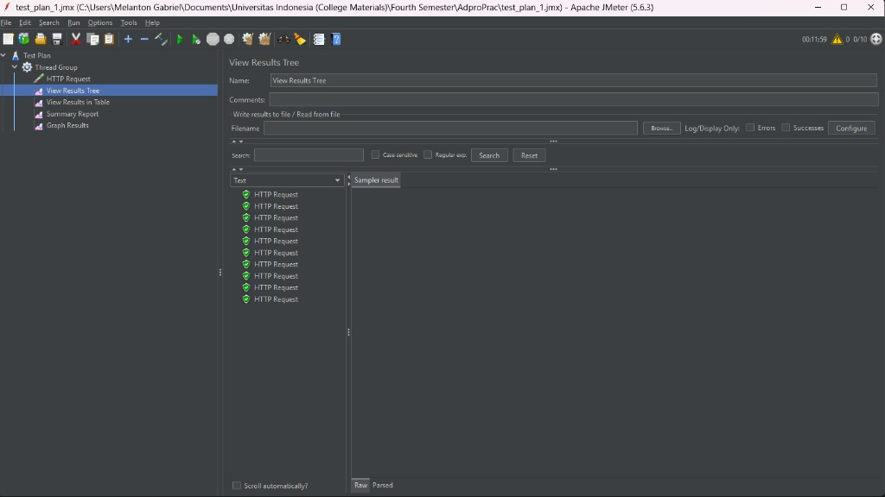

### View Results in Table

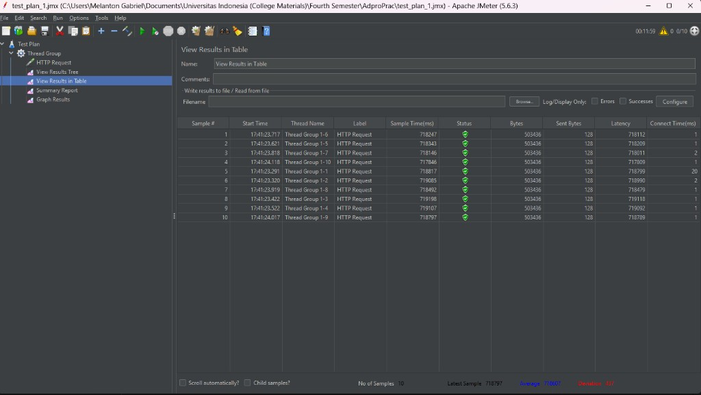

### Summary Report

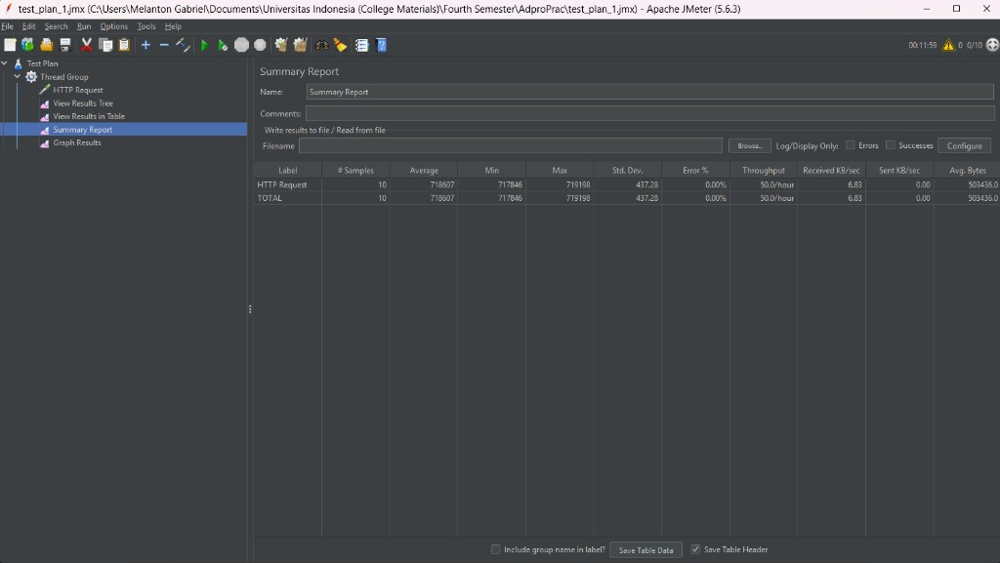

### Graph Results

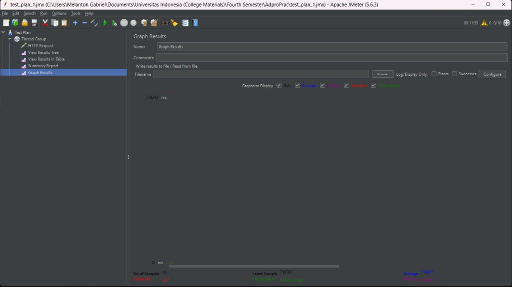

### /all-student-name (GUI)

Test configuration:

- Endpoint: `/all-student-name`
- Threads (users): `10` (target setting from module)
- Ramp-up: `1` second
- Loop count: `1`

#### View Results Tree

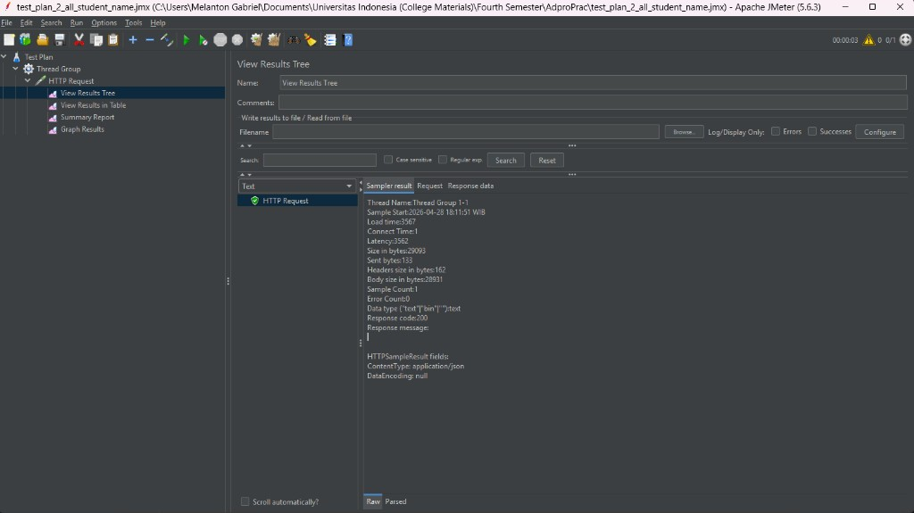

#### View Results in Table

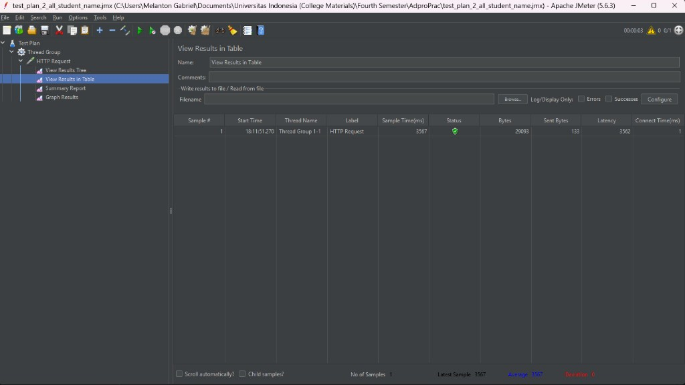

#### Summary Report

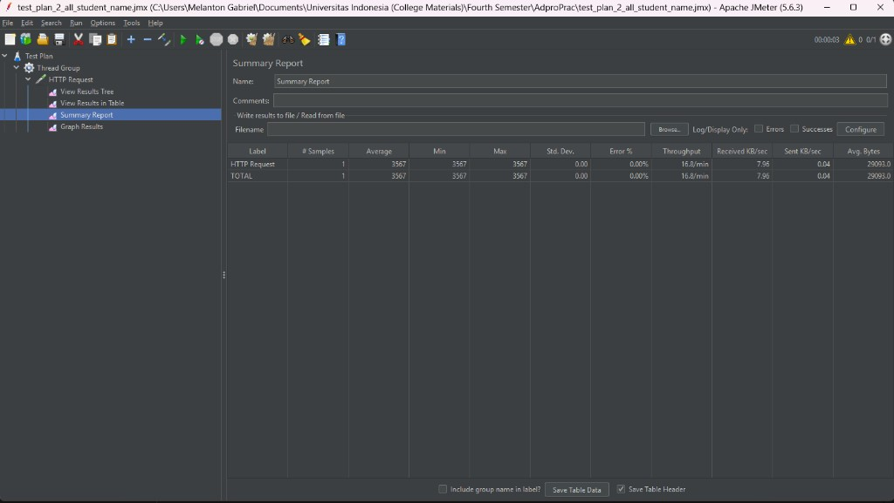

#### Graph Results

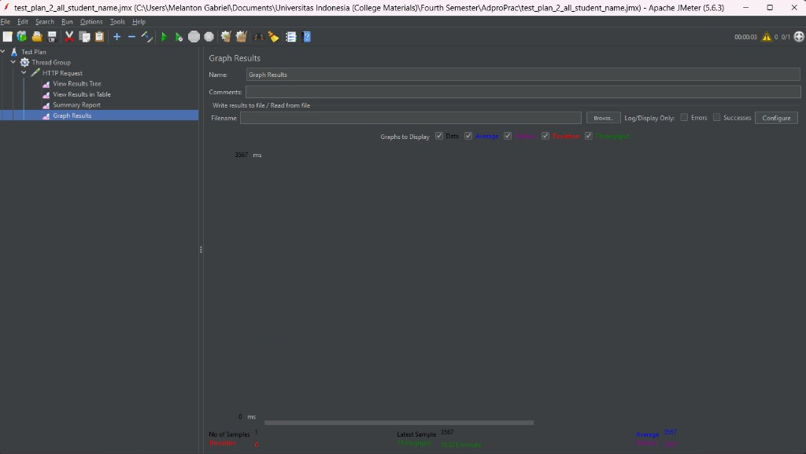

### /highest-gpa (GUI)

Test configuration:

- Endpoint: `/highest-gpa`
- Threads (users): `10`
- Ramp-up: `1` second
- Loop count: `1`

#### View Results Tree

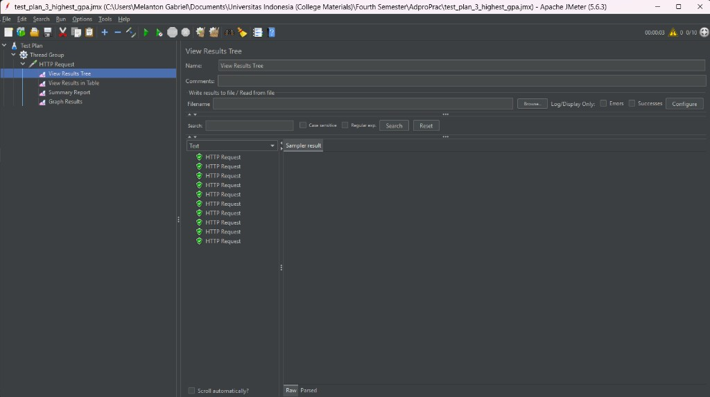

#### View Results in Table

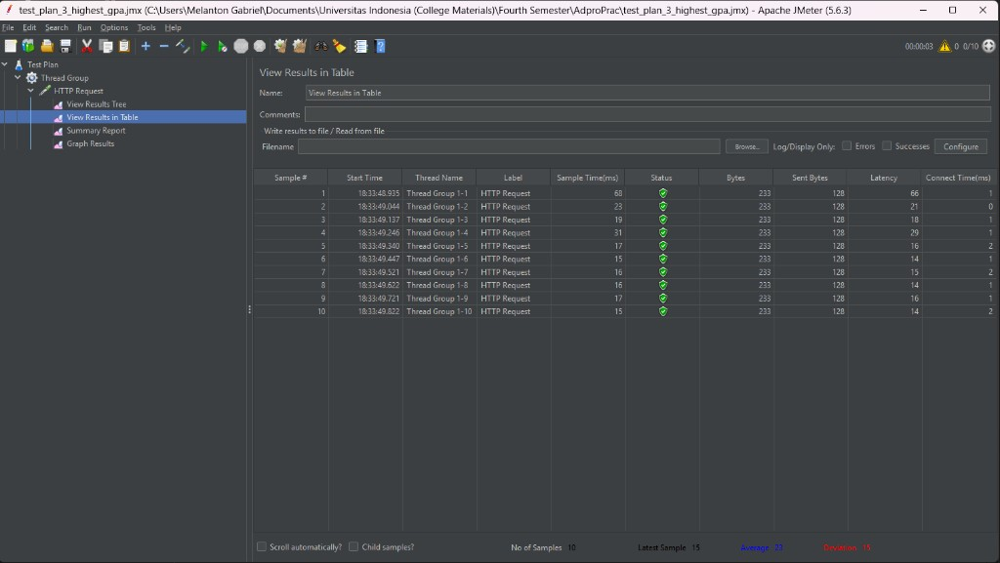

#### Summary Report

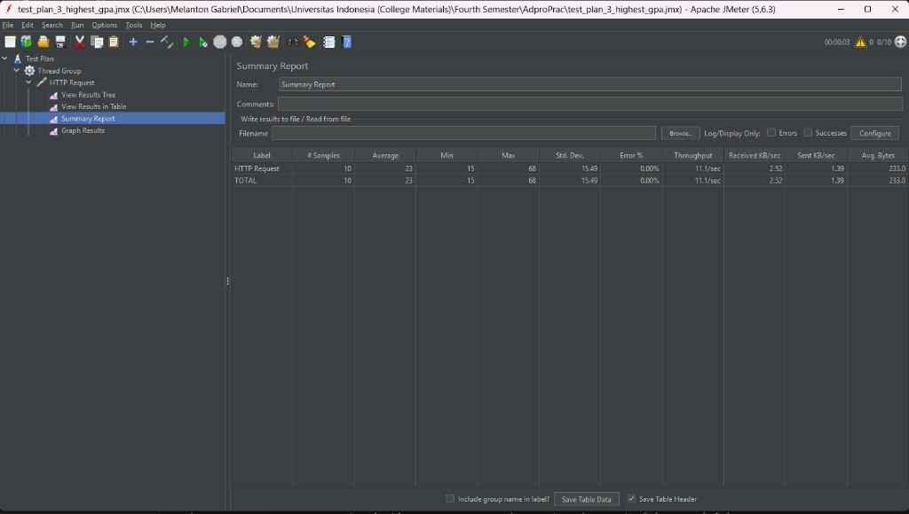

#### Graph Results

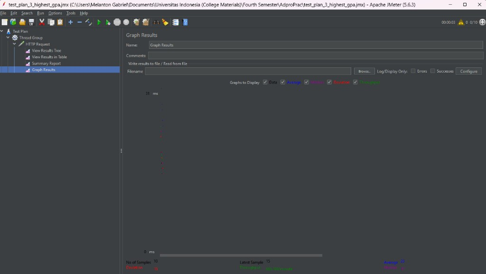

## JMeter CLI Execution

### CLI - /all-student-name

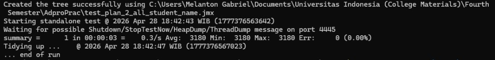

### CLI - /all-student-name (rerun with correct 10 samples)

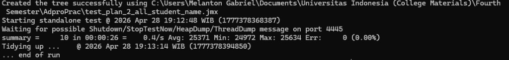

### CLI - /highest-gpa

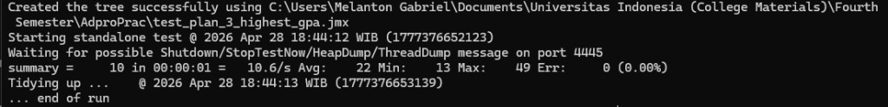

## Profiling and Refactoring

Refactoring focus:

- Reduce N+1 query pattern in `/all-student`
- Fetch names directly for `/all-student-name`
- Add DB index for GPA-related lookup path

### Profiler Comparison (Before)

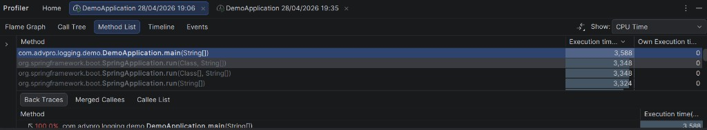

### Profiler Comparison (After)

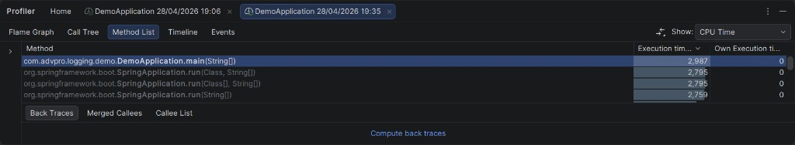

### Conclusion

The second profiling capture shows lower CPU-time values than the initial capture, indicating improved runtime performance after refactoring.

## Fix for Test Plan 2 (/all-student-name)

The first execution of `test_plan_2_all_student_name.jmx` produced only 1 sample due incorrect run setup. The plan was rerun with the correct thread-group settings (`10` threads, `1` ramp-up, `1` loop), and the following evidence reflects the corrected run.

### View Results Tree (Rerun)

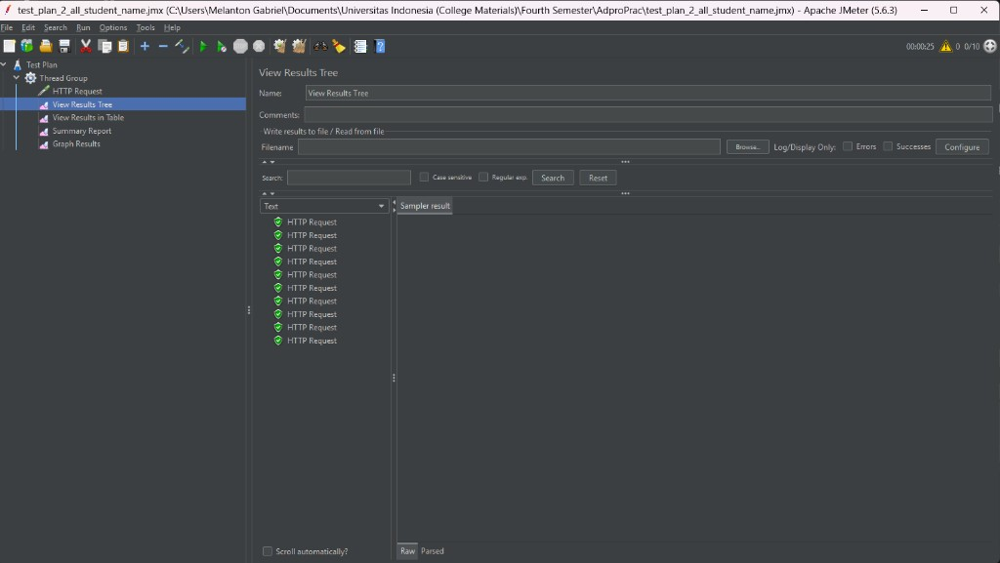

### View Results in Table (Rerun)

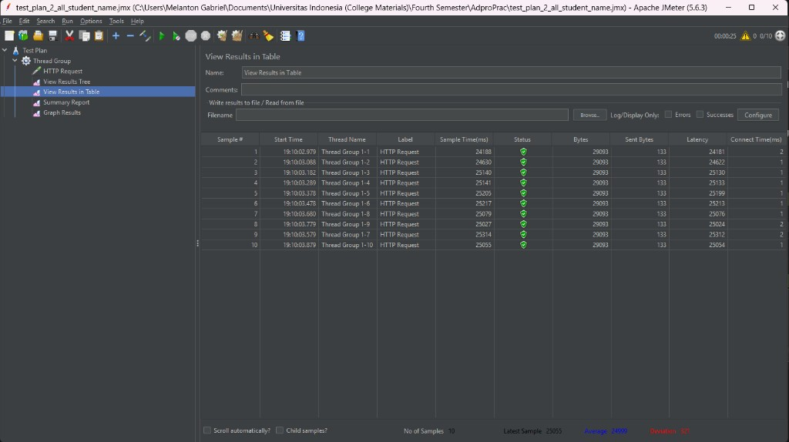

### Summary Report (Rerun)

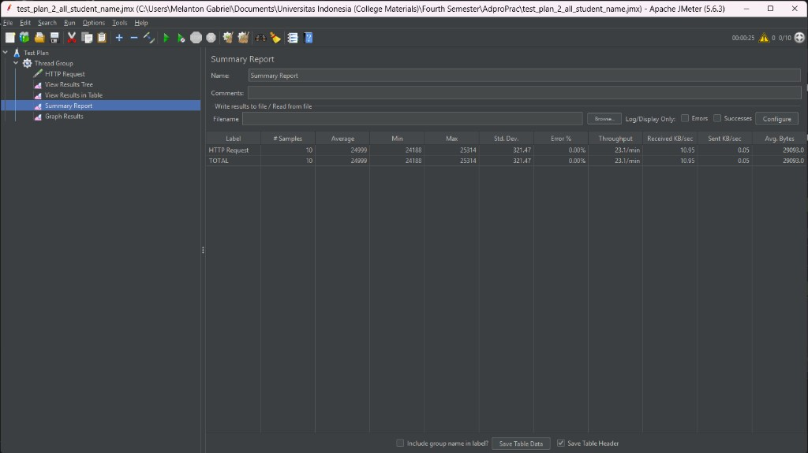

### Graph Results (Rerun)

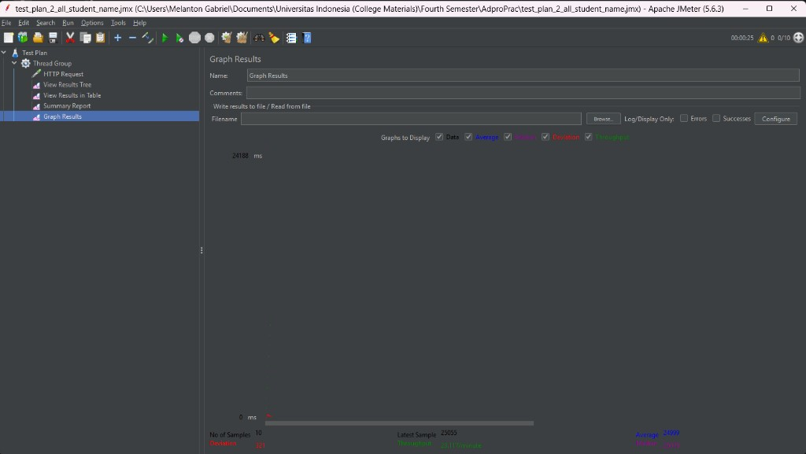

## Reflection

### 1. What is the difference between performance testing with JMeter and profiling with IntelliJ Profiler?

JMeter is used to measure endpoint behavior from an external client perspective under concurrent load, including response time and throughput. IntelliJ Profiler is used to inspect internal code execution, especially method-level CPU time and call hierarchy, so bottlenecks can be traced to specific methods.

### 2. How does profiling help identify and understand weak points in the application?

Profiling shows which methods consume the most CPU time and where execution spends most of its time in the call stack. This helps identify inefficient query patterns, repeated processing, and expensive logic that cannot be seen clearly from endpoint-level metrics alone.

### 3. Is IntelliJ Profiler effective for analyzing bottlenecks?

Yes. IntelliJ Profiler is effective because it provides Flame Graph, Call Tree, and Method List views with CPU-time metrics. These views make it easier to locate expensive methods and verify whether refactoring reduces their cost.

### 4. Main challenges in performance testing and profiling, and how they were handled

Main challenges were environment consistency, endpoint warm-up effects, and interpreting noisy measurements. These were handled by repeating runs, using consistent thread-group settings, and comparing before-vs-after captures with the same endpoints and similar runtime conditions.

### 5. Main benefits gained from IntelliJ Profiler

The main benefits are visibility into method-level hotspots, faster root-cause analysis, and evidence-based refactoring decisions. It reduces guesswork by showing concrete CPU-time changes after optimization.

### 6. Handling inconsistent profiler vs JMeter findings

When profiler and JMeter results are not perfectly aligned, I treat them as complementary signals. Profiler confirms method-level improvements, while JMeter confirms endpoint-level behavior. I rerun tests with consistent settings, compare multiple captures, and use trend direction instead of relying on a single run.

### 7. Strategies for optimization and ensuring functionality is preserved

I focused on reducing expensive database access patterns (for example, replacing N+1 style retrieval with bulk fetch and grouping), minimizing unnecessary entity loading, and adding index support for query paths. To ensure functionality remains correct, I re-hit all target endpoints (`/all-student`, `/all-student-name`, `/highest-gpa`) and verify successful responses after each change.
